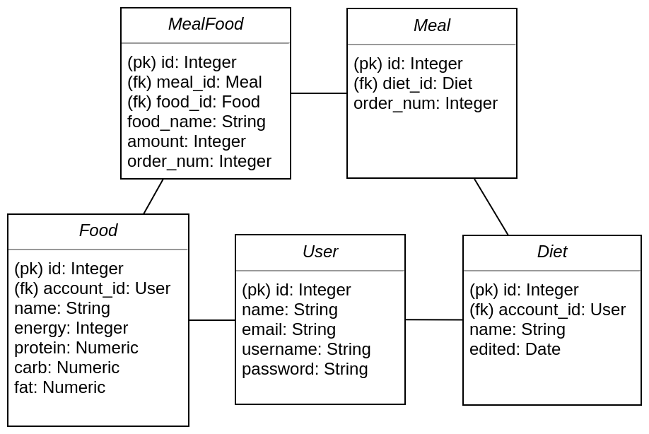

## Tietokanta

Tietokannassa on viisi taulua, joista jokaisella on uniikki id -tunniste. Kaikki taulut ovat normaalimuodossa.

### Käyttäjät

Account -niminen taulu sisältää käyttäjien tiedot. Username-sarake on indeksoitu.

###  Ruoat

Food -tauluun on tallennettu kaikki ruoat makroravinnetietoineen. Lisäksi ruokiin liittyy käyttäjä, joka on ruoan järjestelmään syöttänyt. Ruoan account_id voi olla myös null, jos ruoka on ns. yleinen ruoka järjestelmässä. Yleistä ruokaa voi käyttää osana ruokavaliota, mutta käyttäjillä ei ole oikeuksia niiden muokkaamiseen. Ruoka-taulun name-sarake on indeksoitu.

### Ruokavaliot

Diet -taulu sisältää ruokavalion nimen, sekä tiedon käyttäjästä, jolle se kuuluu. Lisäksi Ruokavaliossa on aikaleima, joka kertoo, milloin se on luotu (käyttää asiakkaan/selaimen aikaa).

### Ateriat

Meal -taulussa on kaikki ateriat. Jokaisesta ateriasta tallennetaan tieto ruokavaliosta, johon se kuuluu, sekä sen järjestys ruokavaliossa.

### Aterioiden ruoat

MealFood -taulu on liitostaulu, joka liittää ateriat ja ruoat yhteen. Taulu toteutettiin niin, että se mahdollistaa myös Food-taululle tuntemattomien ruokien lisäämisen. Tällöin ateriaan voi vapaasti lisätä ruokien nimiä ja määriä, ja käydä vasta myöhemmin lisäämässä ne Food-tauluun. Jokaisesta ruoasta tallennetaan myös sen määrä ateriassa, sekä sen järjestys listauksessa.

 

## Tietokantakaavio

 

## Tietokantaan liittyvät heikkoudet

Tietokanta on pidetty normaalimuodossa, jotta se olisi rakenteeltaan selkeä ja toisteeton. Joillain denormomalisoinneilla olisi voitu saavuttaa jonkin verran parempi suorituskyky. Erityisesti account_id -sarakkeiden lisääminen Meal- ja MealFood-tauluihin olisi vähentänyt näiden tietokohteiden autentikoinnin yhteydessä tehtävien SQL-kyselyiden määrää. Sovelluksen käyttämä SQLALchemy ORM ei käytä mitään välimuistia sessioiden välillä, joten jokainen HTTP-pyyntö tuottaa uudet kyselyt tietokantaan.

Ylläpidettävyyden ja sovelluksen rakenteen parantamiseksi autentikoinnit toteutettiin mahdollisimman säännönmukaisesti siten, että ne tehdään jokaisen HTTP-pyynnön yhteydessä hyvin samantapaisesti. Erityisesti tässä tilanteessa olisi tarvittu jonkinlaista välimuistitoteutusta, jotta useilta kyselyiltä olisi vältytty. SQLAlchemy tukee joitain olemassaolevia välimuistiratkaisuja, mutta niiden käyttö vaatisi syvempää perehtymistä SQLAlcemyyn ja sen tukemiin välimuistiratkaisuihin.

 

## Create table -lauseet

### Account
<pre><code>CREATE TABLE Account (
    id SERIAL,
    name VARCHAR(100),
    email VARCHAR(100),
    username VARCHAR (60),
    password VARCHAR(60),
    PRIMARY KEY (id)
);
</code></pre>

### Food

<pre><code>CREATE TABLE Food (
    id SERIAL,
    account_id INTEGER,
    name VARCHAR(100),
    energy INTEGER,
    protein NUMERIC,
    carb NUMERIC,
    fat NUMERIC,
    PRIMARY KEY (id),
    FOREIGN KEY (account_id) REFERENCES Account(id)
);
</code></pre>

### Diet

<pre><code>CREATE TABLE Diet (
    id SERIAL,
    account_id INTEGER,
    name VARCHAR(100),
    edited DATE,
    PRIMARY KEY (id),
    FOREIGN KEY (account_id) REFERENCES Account(id)
);
</code></pre>

### Meal

<pre><code>CREATE TABLE Meal (
    id SERIAL,
    diet_id INTEGER,
    order_num INTEGER,
    PRIMARY KEY (id),
    FOREIGN KEY (diet_id) REFERENCES Diet(id)
);
</code></pre>

### MealFood

<pre><code>CREATE TABLE MealFood (
    id SERIAL,
    meal_id INTEGER,
    food_id INTEGER,
    food_name VARCHAR(100),
    amount INTEGER,
    order_num INTEGER,
    PRIMARY KEY (id),
    FOREIGN KEY (meal_id) REFERENCES Meal(id),
    FOREIGN KEY (food_id) REFERENCES Food(id)
);
</code></pre>
